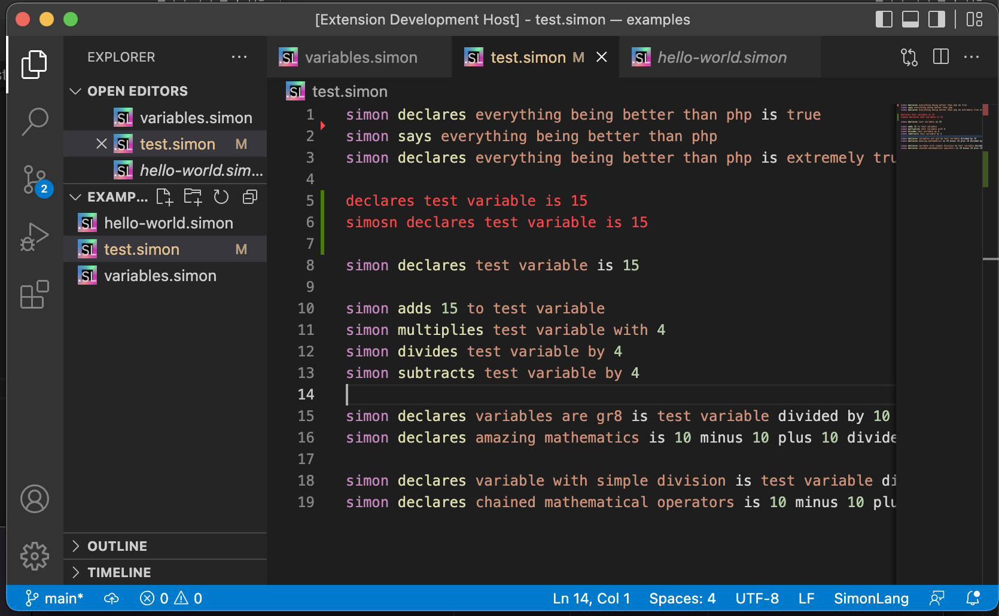

# simonlang README

This is the language support extension ["simonlang"](https://github.com/puresamari/simon).

## Features

- Syntax tokenization.
- Syntax highlighting.
- Icons for .simon extension.

## Known Issues

Variables are not contextually understood.

## Release Notes

### 1.1.0

- `[Added]` new icon for `.simon` files for readability.

### 1.0.0

Initial version
