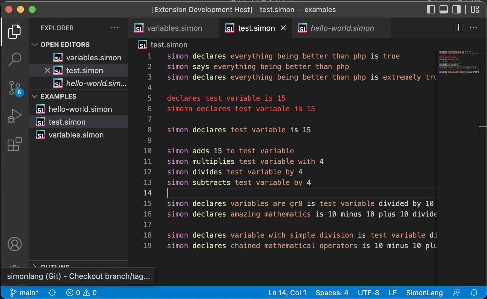

# simonlang README

This is the language support extension ["simonlang"](https://github.com/puresamari/simon).

## Features

- Syntax tokenization.
- Syntax highlighting.
- Icons for .simon extension.

## Requirements

If you have any requirements or dependencies, add a section describing those and how to install and configure them.

## Extension Settings

Include if your extension adds any VS Code settings through the `contributes.configuration` extension point.

For example:

This extension contributes the following settings:

* `myExtension.enable`: enable/disable this extension
* `myExtension.thing`: set to `blah` to do something

## Known Issues

Variables are not contextually known.

## Release Notes

### 1.0.0

Initial version
